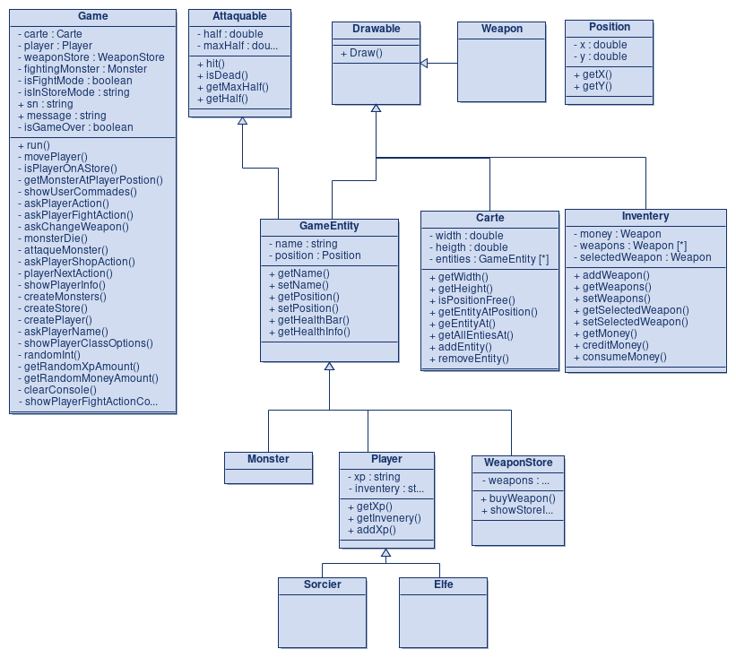

# RPG

## Choix de design du projet Mini RPG Textuel

Le projet a été conçu en **programmation orientée objet** pour assurer une structure claire et évolutive.
La classe **`Game`** centralise la logique principale (déplacements, combats, magasin) tandis que la classe **`Carte`** gère la carte du donjon sous forme de grille 2D contenant les entités.

Les entités du jeu (joueur, monstres, obstacles) héritent de la classe **`GameEntity`**, qui regroupe les attributs communs comme le nom, la position et la santé. Les classes **`Player`** et **`Monster`** implémentent l’interface **`Attaquable`**, permettant un système de combat générique et polymorphe.

L’inventaire du joueur est géré par la classe **`Inventory`**, qui contient les armes et l’argent, tandis que **`WeaponStore`** permet d’acheter de nouveaux équipements.
La classe **`Position`** simplifie les déplacements sur la carte et les interactions entre entités.

Ce design repose sur les principes d’**encapsulation**, d’**héritage** et de **polymorphisme**, facilitant la maintenance et l’ajout de nouvelles fonctionnalités (nouvelles classes, armes, ou monstres) sans modifier la structure existante.

## UML Diagram

